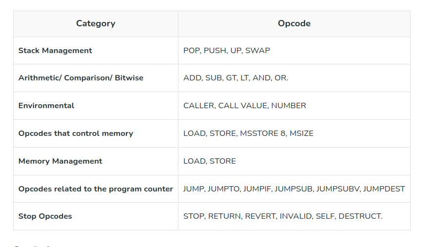

# Sample Hardhat Project

This project demonstrates a basic Hardhat use case. It comes with a sample contract, a test for that contract, and a script that deploys that contract.

Try running some of the following tasks:

```shell
npx hardhat help
npx hardhat test
REPORT_GAS=true npx hardhat test
npx hardhat node
npx hardhat run scripts/deploy.ts
```

# YUL
```
https://docs.soliditylang.org/en/v0.8.19/yul.html#yul
```


###EVM dialect
```
https://docs.soliditylang.org/en/v0.8.19/yul.html#evm-dialect
```

* Opcodes take arguments (given in parentheses) always from the top of the stack.
* Opcodes marked with a - (second column) do not push items onto the stack. For most of them in the list, they return values in memory
* All other opcodes push items onto the stack (their “return” value).
* Opcodes marked with F, H, B and C are present since Frontier, Homestead, Byzantium and Constantinople version of Ethereum.
* mem[a...b) signifies the bytes of memory starting at position a up to (but not including position b.
* storage[p] signifies the storage contents at position p.


###Opcode can be divided into the following categories




###4 opcodes related to bytecode of a contract 
```
codesize, codecopy: enable you to read/copy the bytecode of contract we are currently executing
``` 

```
extcodesize, extcodecopy: enable read/copy bytecode of another external contract from a contract
```

###string literals can be up to 32 characters.


###Accessing variables in Solidity Assembly
You can access local variables (or other identifiers) simply by using their variable name. The variables must be local to the function

###If - no else

###function
**leave** keyword can only be used inside a function
if you call a function that returns multiple values, you have to assign them to a tuple


### Function style
```
mstore(0x80, add(mload(0x80,3))) // add 3 to content located at memory address 0x80
```

### non-Function style
```
3 0x80 mload  add 0x80 mstore // add 3 to content located at memory address 0x80
```

## Disadvantage of writing assembly

it bypasses several important safety features and checks of Solidity