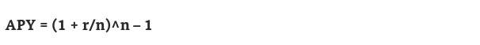

## Staking
Blockchain contract that allows users to lock their crypto assets ino a pool for a specific time to earn rewards
### LOG - logarithm 
`LOG(value, [base])`  default base = 10
LOG(8,2) = 3

For example: 2 to the 3rd power, equal 8

2 to the power of 5 equals 32
### APR - Annual Percentage Rate
APR represents the yearly rate charged for borrowing money

`APR= cost of borrowing money / loan for year`

### APY - Annual Percentage Yield
APY measures the amount of interest you earn when you save.
Don't forget for  compound your interest

r: period rate

n: number of compounding period 