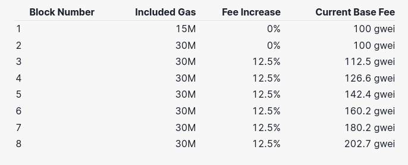

### Gas
[Link](https://ethereum.org/vi/developers/docs/gas/)

Each transaction requires computational resources to execute, each transaction requires a fee

` units of gas used * (base fee + priority fee)`

Let's say Jordan has to pay Taylor 1 ETH. In the transaction, the gas limit is 21,000 units and the base fee is 10 gwei. Jordan includes a tip of 2 gwei.

21,000 * (10 + 2) = 252,000 gwei or 0.000252 ETH

Validator receives the tip of 0.000042 ETH. Base fee of 0.00021 ETH is burned.

maxFeePerGas. The difference between the max fee and the actual fee is refunded to Jordan, i.e. refund = max fee - (base fee + priority fee)

### Block size
Each block has a target size of 15 million gas. but the size of blocks will increase or decrease in accordance with network demand, up until the block limit of 30 million gas

This means if the block size is greater than the target block size, the protocol will increase the base fee for the following block.

### Base fee
Base fee is calculated independently of the current block - making transaction fee more predictable for users.
When block minted the base fee is "burned"

base fee is calculated by formula that compares the size of previous block. The base fee will increase by a maximum of 12.5% per block if target size exceed.

### Priority fee (tips)
Before London Upgrade, miners would receive the total gas fee from any transaction.

London Upgrade introduced a priority fee to incentivize miners to include a transaction in the block.

a higher tip was necessary to attempt to outbid competing transactions.

### EIP 1559
It has the advantage of making gas fees more predictable. User can submit `maxFeePerGas` corresponding to how much they are willing to pay for transaction to be executed

### Gas limit
Gas limit refers to maximum amount of you are willing to consume on as transaction. More complicated transactions involving smart contract require mote computational work.

A standard ETH transfer requires a gas limit of 21000 units of gas.

If set gas limit of 20000 for a simple ETH transfer, the EVM will consume your 20000 gas units but transaction not complete.
