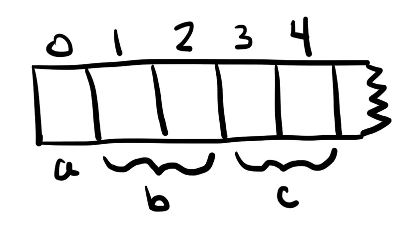

### Read chain data
[REF](https://viblo.asia/p/storage-trong-ethereum-smart-contract-OeVKByMr5kW)

Private data in smart contract is not really private 

So marking a variable as private only prevents other contracts from accessing it
State variables marked as private and local variables are still public accessible

To ensure that data is private, it needs to encrypt before put onto blockchain. And decryption key should never be sent to blockchain

```javascript

web3.eth.getStorageAt(<address>, <data index location>, (err, result) => console.log(web3.toAscii(result)));
```

### Storage
Storage has 2^256 slots

Each slot have 256 bits or 32 bytes. So subtract 1 from 0 will get underflow, and get (2 ^ 256 -1) 

Struct {} will create new slot 

Fixed size array will create new slot

Dynamic array will create new slot, slot stores length of array, value of item stores in other location

Mapping will crete one new slot, value stores in other location

String will create new slot, this slot store length and content of string.
- If string less than 32 bytes, content store in bit left -> right (higher order). Length stores in bit right -> left (lower order) with value `length*2` (means number of hex character)
- If string more than 32 bytes, main slot will store length of string `length * 2 + 1`. Content store at `keccak256(p)` p is location main slot

`constant` not store in storage

`EVM` processes each block of 32 bytes each calculation, so if component less than 32 bytes, EVM need a step to down size from 

The smallest data structure takes 8 bits

> keccak256 is web3.sha3

**Example 1**
```solidity
contract StorageTest {
  uint256 a;
  uint256[2] b;

  struct Entry {
    uint256 id;
    uint256 value;
  }
  Entry c;
}
```


**Example 2**
```solidity
pragma solidity ^0.4.23;

contract StorageTest {
  uint128 public a = 7;
  bool public b = true;
  uint64 public c = 10;
  address public d = 0xdc241a86c63487eb57ff4bda8a3105702f5fbf69;
  uint256 public e = 123;
  uint8 public f = 4;
  uint256 public g = 567;
}

```
```text
Slot 0: a(128), b(8), c(64), 
Slot 1: d(160)
Slot 2: e(256)
Slot 3: f(8)
Slot 4: g(256)
```

**Example 3**
```solidity
contract StorageTest {
  uint256 a;     // slot 0
  uint256[2] b;  // slots 1-2

  struct Entry {
    uint256 id;
    uint256 value;
  }
  Entry c;       // slots 3-4
  uint256[] d;   // Dynamic 
  Entry[] e;

  constructor () public {
    d.push(1244);
    d.push(14);
    e.push(Entry(9, 99));
  }
}

```
```text
Slot 0: a(256)
Slot 1: b[0](256)
Slot 2: b[1](256)
Slot 3: c.id(256)
Slot 4: c.value(256)
Slot 5: d , because constructor create 2 items for d so content of slot 5 is 2
...
Slot keccak256(hex(5)): d[0] (256)
Slot keccak256(hex(5)) + 1: d[1] (256)
Slot 6: e and value is 1
Slot keccak256(hex(6)): e[0].id
Slot keccak256(hex(6)) + 1: e[0].value
```

**Example 4**

```solidity
contract StorageTest {
  uint256 a;     // slot 0
  uint256[2] b;  // slots 1-2

  struct Entry {
    uint256 id;
    uint256 value;
  }
  Entry c;       // slots 3-4
  uint256[] d; // slot 5
  Entry[] e; // slot 6

  mapping (uint256 => uint256) f;

  constructor () public {
    f[162] = 13;
    f[789] = 543;
  }
}

```


```text
... 
Slot 7: f 
Slot keccak256(hex(162) + hex(7)): f[162]
Slot keccak256(hex(789) + hex(7)): f[789]
```