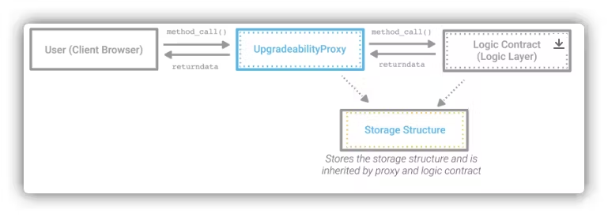

### Upgradable 

This below image shows UUPS(Universal Upgradeable Proxy standard)

`initialize()` is a special function with `initializer` modifier, it acts as a constructor which can only be called one.
