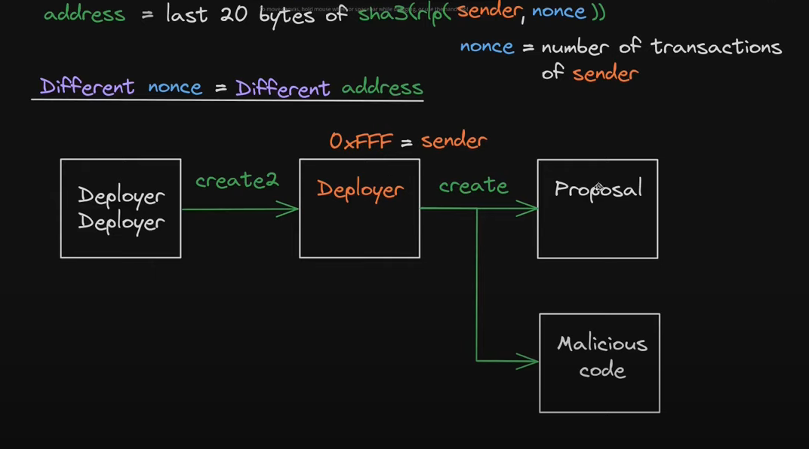
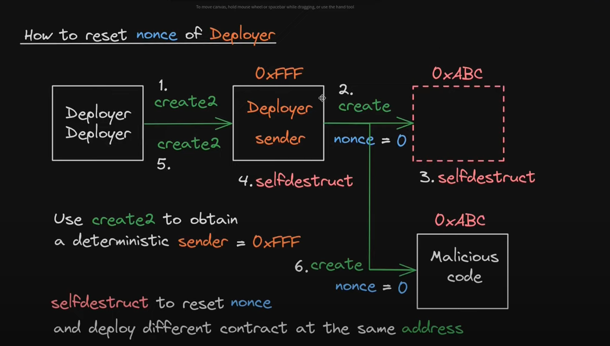

### 1. References

https://solidity-by-example.org/hacks/deploy-different-contracts-same-address/

https://www.youtube.com/watch?v=zYaHtUJN-MI

https://www.youtube.com/watch?v=whjRc4H-rAc


### 2. Problem Description

#### 2.1. How is contract address computed using create?
```
address = last 20 bytes of sha3(rlp(sender, nonce))

sender = contract
nonce = number of transaction of sender

```

=> same sender, nonce is trick
#### 2.2. How to reset nonce of deployer


### 3. Methods

```
RLP: RECURSIVE-LENGTH PREFIX SERIALIZATION
use to encode structure, encoding specific data types (e.g. strings, floats is left up to higher -order protocol)
```

```
selftdestruct: Contracts can be deleted from the blockchain
selfdestruct sends all remaining Ether stored in the contract to a designated address.
https://solidity-by-example.org/hacks/self-destruct/
```

```
create2: can precompute contract address with create2
This syntax is a newer way to invoke create2 without assembly, you just need to pass salt
https://docs.soliditylang.org/en/latest/control-structures.html#salted-contract-creations-create2
return address(new TestContract{salt: _salt}(_owner, _foo));
```